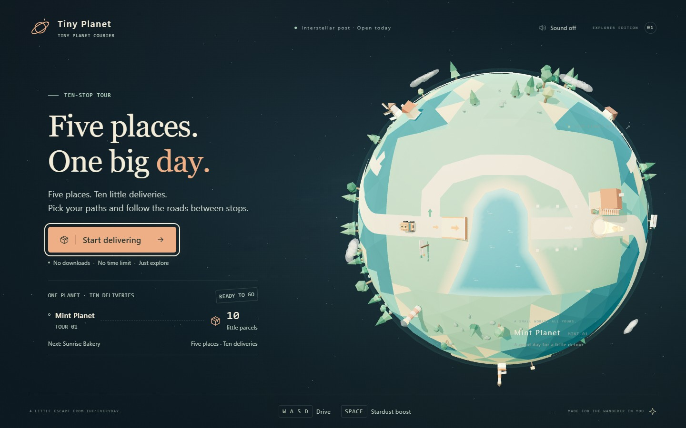
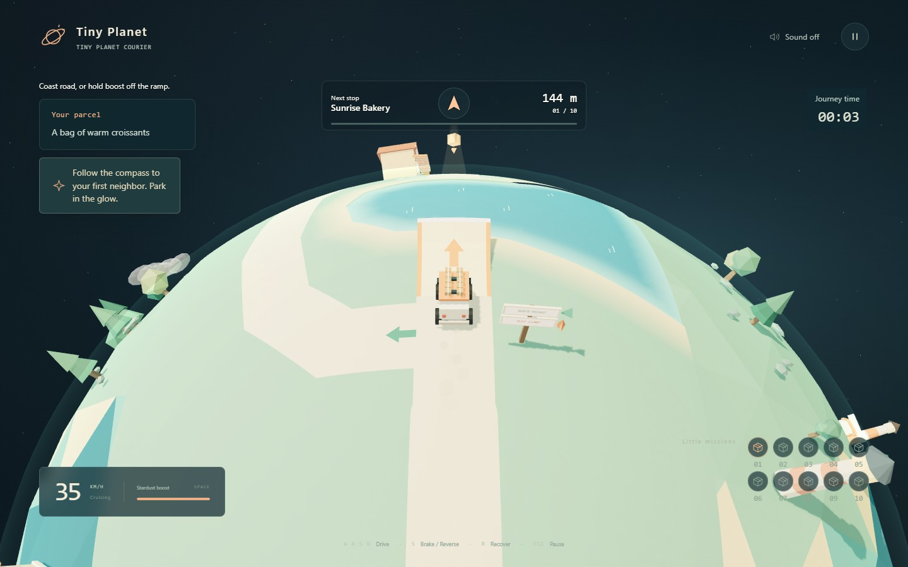

<div align="center">
  <h1>🪐 Tiny Planet Courier</h1>
  <p><strong>A tiny planet. Five neighbors. Ten little deliveries.</strong></p>
  <p>Take the scenic route in a cozy, low-poly 3D browser game.</p>
  <p>
    <a href="https://tonghaoch.github.io/tiny-planet-courier/"><strong>Play in your browser</strong></a>
    &nbsp;·&nbsp;
    <a href="#run-locally">Run locally</a>
    &nbsp;·&nbsp;
    <a href="#how-to-play">Controls</a>
    &nbsp;·&nbsp;
    <a href="#build-and-test">Build &amp; test</a>
  </p>
  
  <p><sub>Five places, ten deliveries, one connected planet. Your first destination varies with each new Tour offer.</sub></p>
</div>

### The scenic route is the whole point.

Hop into your little van for **ten deliveries across five physical sites**: Sunrise Bakery, Stargaze Station, Windmill Garden, and the new southern **Beacon Post** (replacement lamp) and **Redrock Depot** (repair supplies). Visit every neighbor twice on one connected planet. There is no countdown to beat—just ten parcels and a planet worth exploring.

- **Familiar roads, new neighbors.** The accepted Bay, Station and Garden courses, anchors and driving feel stay unchanged. New southern routes extend the journey, not the planet's radius.
- **A shuffled day out.** Two shuffled sets of all five sites give exactly two visits each. Neither of the previous two destinations repeats next, and no directed delivery pair repeats. Home/new Tour offers a fresh random draw, not a guaranteed unique route; Start and Restart use the exact offered plan.
- **Small deliveries, zero rush.** Park in the glow, hand over one roof parcel and watch that neighbor react. Repeated visits replay only that site's reaction; no scene swaps or intermediate results screens.
- **Find your own way.** The destination compass points toward the active neighbor, not along a safe road. Roads and left-side hints supply context; free driving remains available.
- **Keep the journey going.** Recovery preserves progress at earned safe points. Finish for a total, ten leg splits and a browser-local best for that exact itinerary, then keep driving or retry.
- **One link, no installation for players.** WebGL 2, keyboard or touch, no account or backend.

<p align="center">
  
  <br />
  <sub>Early driving near the Bay ramp, with all ten parcels aboard. This Tour drew Sunrise Bakery first; the other locations lie beyond this view.</sub>
</p>

[Play in your browser](https://tonghaoch.github.io/tiny-planet-courier/), or run the game locally. See the [release checkpoint](docs/iteration-plan.md#five-location-release-checkpoint--2026-09-11) and [Tour design](docs/tour-plan.md#current-five-location-ten-delivery-contract).

---

## Run locally

Requires Node.js 20.19+ or 22.12+; **Node.js 24 is recommended**.

```sh
git clone --branch main https://github.com/tonghaoch/tiny-planet-courier.git
cd tiny-planet-courier
npm ci
npm run dev
```

Open **http://127.0.0.1:5173/** (or the terminal's URL). The server listens only on your computer by default; phone access requires configuring a trusted local network.

For an existing clone, preserve local work before `git fetch origin`, `git switch main`, and `git pull --ff-only origin main`. Stop if switching or fast-forwarding is blocked; do not discard work. See the [cross-computer instructions](docs/iteration-plan.md#continue-on-another-computer).

### Development-only comparisons and tools

Both normal roots enter Tour. In **Vite development mode only**, explicit selectors remain available:

| Local URL | Experience |
| --- | --- |
| [/?prototype=bay](http://127.0.0.1:5173/?prototype=bay) | One-parcel Bay Leap: coast road or ramp shortcut |
| [/?prototype=station](http://127.0.0.1:5173/?prototype=station) | One letter for Station: wide outer road or tighter inner lane |
| [/?prototype=garden](http://127.0.0.1:5173/?prototype=garden) | Flower seeds for Garden: wide loop or flowing Flower path |
| [/?prototype=standard](http://127.0.0.1:5173/?prototype=standard) | Original three-delivery comparison |
| [/?prototype=tour](http://127.0.0.1:5173/?prototype=tour) | Explicit Tour, equivalent to the root |
| [/?test=1&tourSeed=227](http://127.0.0.1:5173/?test=1&tourSeed=227) | DEV + test-only deterministic Tour offer |

Missing, empty or unknown development selectors fall back to Tour. Standalone experiments retain playtest branding and independent records. Production ignores **all prototype, test and seed overrides** and has no test bridge.

<a id="compact-hud-and-small-screen-welcome--locally-verified-owner-approval-pending"></a>

The [iteration history](docs/iteration-plan.md), [historical three-stop release](docs/tour-plan.md#historical-three-stop-release--2026-09-09) and [destination-compass contract](docs/navigation-stability-plan.md) preserve earlier acceptance and release evidence.

## How to play

| Action | Controls |
| --- | --- |
| Drive forward | W / ↑ |
| Steer left or right | A, D / ←, → |
| Brake, then reverse | S / ↓ |
| Stardust boost | Hold Space; energy recharges when released |
| Recover the van and stop | R |
| Pause / resume | Esc |

Touchscreens have steering, throttle, brake and boost buttons. Sound effects are off by default; enable them at the top right.

Use the **top-center destination compass** and world marker. The arrow may point across water or obstacles. The authored road graph retains **Bay → Station → Garden → Bay** and adds **Station → Depot → Beacon → Station**; it describes routes, not an imposed traffic rule. Transfers use safe ground paths, including Bay's coast—there is no reverse Bay leap. The forward Bay ramp still launches the van; boost alone does not make it hop on flat ground.

**Slow down and park inside the glowing ring** for the brief handoff dwell. Speeding through or flying over it does not count. Each delivery consumes one parcel and immediately retargets the compass. If the road exit is behind you, reverse and turn gently.

**R** or splash recovery returns to the latest earned safe point without losing parcels, splits or active journey time. Entrance earning resets each leg; only actually reached grounded arrivals/transit earn recovery, so it cannot skip an unvisited transfer.

Complete all **ten deliveries** to freeze scoring while keeping driving available. Transfers count toward the following split; pauses do not. The nonblocking result card has native, initially collapsed details with bounded scrolling for all ten splits, including compact portrait and short-landscape layouts. Best times compare the **same ordered itinerary, layout, scoring and start**, not arbitrary routes or old three-stop records. Restart resets cargo, reactions, checkpoints and time but retries the same offer; Home requests a fresh draw. There is no time limit or failure countdown.

## Build and test

Local release verification passed **487 Vitest tests + 11 Node audit tests**, format/lint/types/build, **104 distinct DEV browser cases across sequential fresh-process groups**, then **24/24 production cases**. DEV coverage was grouped, not a single successful 104-case invocation. See the [release checkpoint](docs/iteration-plan.md#five-location-release-checkpoint--2026-09-11) for exact groups, repair history, production-port exception and limitations, and [architecture](docs/architecture.md) for commands and budgets.

```sh
npm run check         # Format, lint and all-project types
npm run verify        # check + Vitest + Node bundle tests + build + budget audit
npm run test:browser  # DEV browser suite; after verify finishes
npm run test:preview  # Build + production suite; after DEV, requires free port 4173
npm run preview      # Serve the existing build
```

- `npm run format` writes Biome formatting; `npm test` runs Vitest; `npm run build` checks runtime TypeScript and generates `dist/`.
- Browser checks default to installed Microsoft Edge; use `PLAYWRIGHT_CHANNEL=chrome` for installed Chrome. Actual Safari/WebKit and hardware-phone checks were not performed.
- Keep browsers **sequential and exclusive**: freeze source/build/worktrees during DEV checks. Do not run groups concurrently, build mid-run or stop an unrelated preview.
- Generated diagnostics stay in ignored `artifacts/` and `test-results/`; the two selected README JPEGs are maintained documentation assets.

Production uses the `/tiny-planet-courier/` base path; `npm run preview` normally serves **http://127.0.0.1:4173/tiny-planet-courier/**. DEV uses `/`. Update `vite.config.ts` for a different deployment path. Do not open `index.html` with a `file://` URL.

## Automatic deployment

**Play:** https://tonghaoch.github.io/tiny-planet-courier/

The [Pages workflow](.github/workflows/deploy.yml) runs on pushes to `main` or manual dispatch. Both it and [PR CI](.github/workflows/ci.yml) run `npm run verify`. The release workflow:

1. Sets up Node.js 24 and installs locked dependencies with `npm ci`.
2. Runs `npm run verify` (static checks, Vitest, Node bundle tests, build and audit).
3. Uploads `dist/` with the official Pages artifact action.
4. Deploys using the `github-pages` environment, restricted to `main`.

Verification must succeed. GitHub's built-in token is sufficient; no personal token or additional secret is required. Build artifacts stay out of Git. Confirm publication from successful Actions and Pages status for the **exact pushed SHA**, followed by an independent public-site smoke check—not from a push alone.

To redeploy an authorized release, use **Actions → Deploy to GitHub Pages → Run workflow → main**. **Settings → Pages → Source** must be **GitHub Actions**. Browser tests are separate local checks, not part of the Ubuntu workflows.

## Technology and scope

- **Vite + TypeScript + Three.js**, native HTML/CSS; no new runtime dependencies.
- Procedural planet, roads, van, landmarks, vegetation, clouds and stars. No external models, fonts, textures or CDN requests.
- Static scenery batches by material; rocks use instancing. Fixed-step driving, simple collision bounds, smooth chase camera and reusable particles remain.
- Web Audio sound and browser-local `localStorage` bests; the game still works without storage. Old records remain untouched.
- Modern WebGL 2 required, with a recovery message for unavailable/lost graphics context.
- No multiplayer, orbital simulation, dynamic terrain, extra planets or online leaderboards.

### Browser test helpers and screenshots

Only **Vite DEV with a `test` parameter** exposes `window.__planetTest`. Snapshots observe state and `setControls` drives the real controller. The shared `tests/helpers/tour-browser-driver.ts` computes controls on page animation frames, with heavy assertions outside the feedback loop. It is **test-only**, not a game autopilot or physics change. Docking and navigation pose fixtures prove UI/state, not route playability. Production has no bridge regardless of query parameters.

The README images are real five-location production-preview captures from 2026-09-11, using normal Start/keyboard input—not fixtures, modified HUDs or generated artwork. [Capture provenance](docs/iteration-plan.md#five-location-screenshot-provenance--2026-09-11) records settings, sizes and limits. Contributors and agents must follow [AGENTS.md](AGENTS.md), discovered through `CLAUDE.md`.
